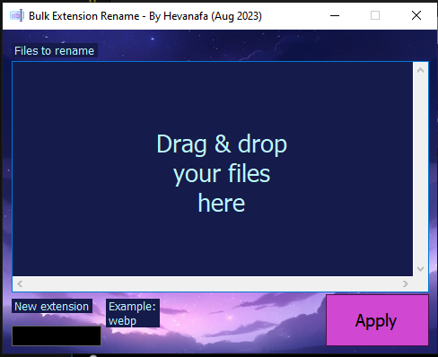

# Bulk Rename Extension

By Hevanafa (Aug 2023)

A tool to easily rename file extensions in just one click.

Written in VB .NET.

## How to Use

1. Drag & drop the files that you want to rename,
2. Enter the new extension,
3. Press Apply.